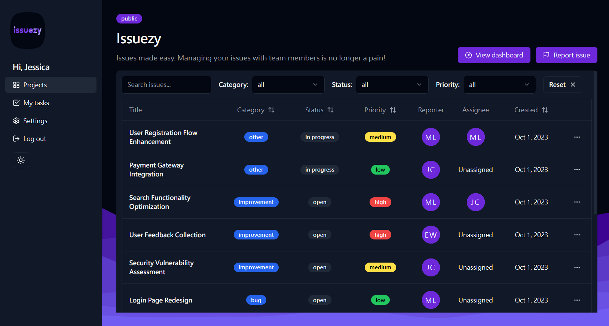
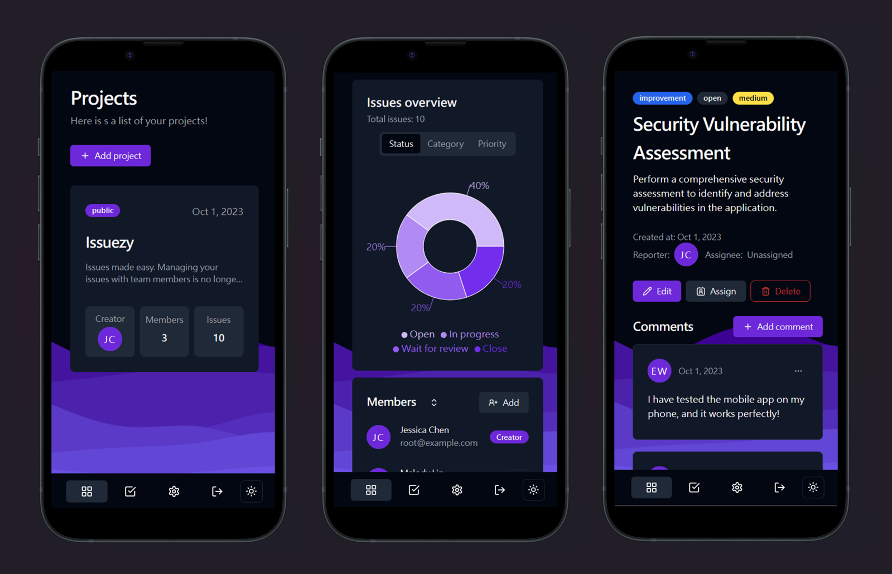
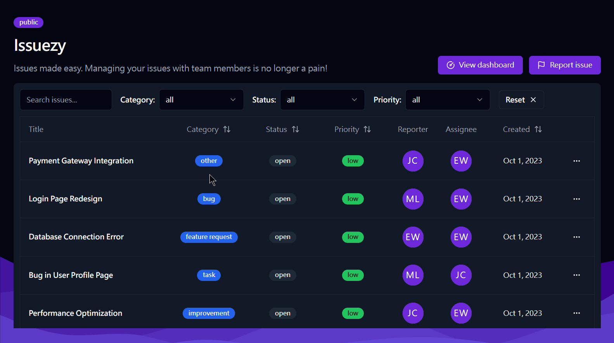
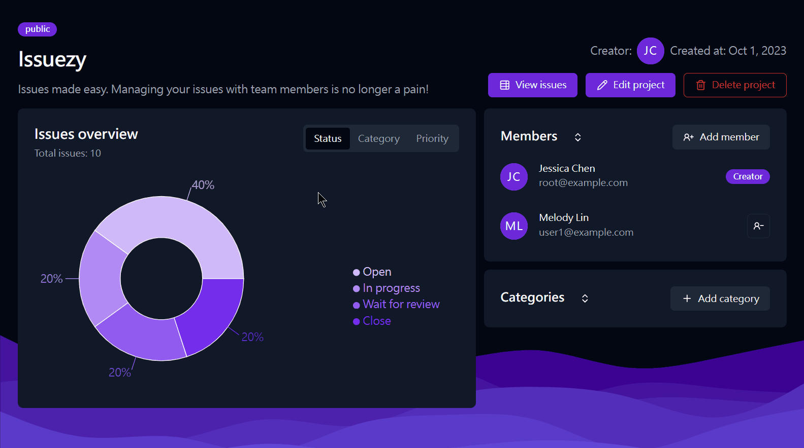
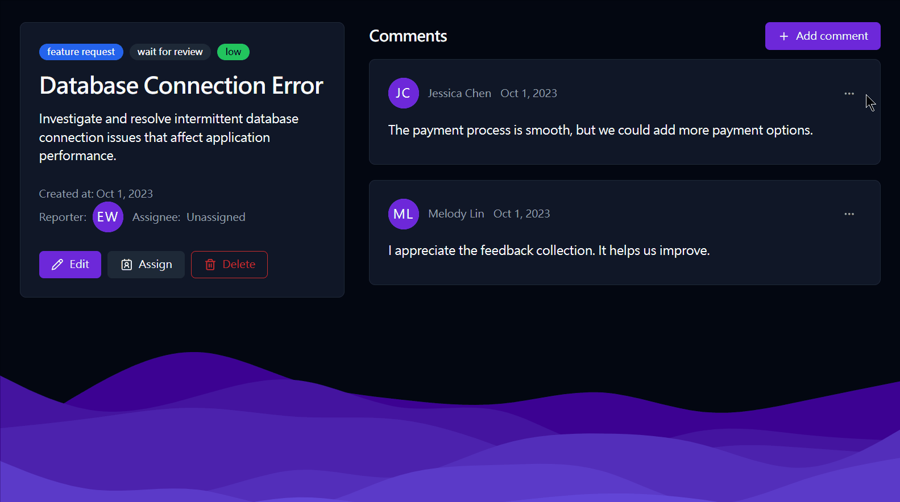
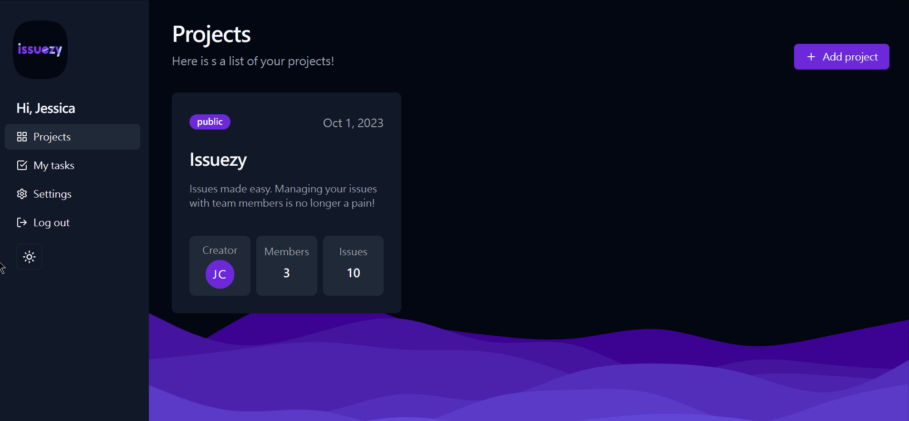
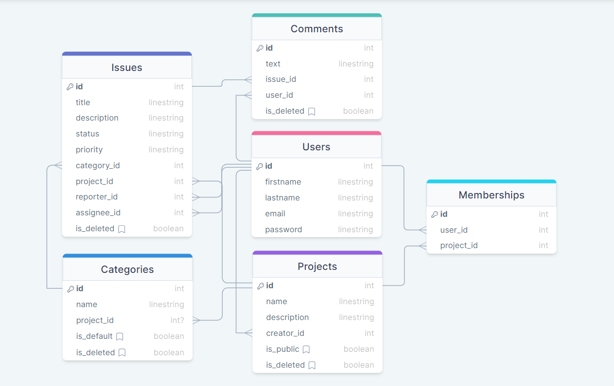
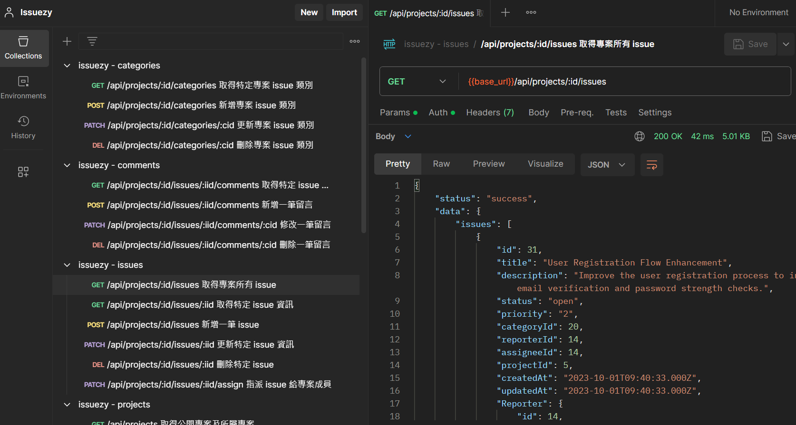

<div align="center">
  

#### Issue made easy. Manage issues and collaborate with ease.

</div>

### 📜 Table of contents

<details>
<summary>Click me</summary>

- [💡 Overview](#-overview)
- [👀 Live demo: https://issuezy.netlify.app](#-live-demo-httpsissuezynetlifyapp)
- [🧩 Built with](#-built-with)
  - [Front-end](#front-end)
  - [Back-end](#back-end)
- [✨ Key features](#-key-features)
  - [Other features](#other-features)
  - [🤔 Future features](#-future-features)
- [🚀 Run locally](#-run-locally)
  - [Back-end](#back-end-1)
  - [Front-end](#front-end-1)
- [🤯 Development process](#-development-process)
  - [ERD (Entity Relationship Diagram)](#erd-entity-relationship-diagram)
  - [📦 File structure](#-file-structure)
  - [Others](#others)
- [🔒 License](#-license)

</details>

## 💡 Overview

Issuezy is a full-stack project management and issue tracking app where you can keep your team organized. Easily track bugs, tasks, or improvements, all while collaborating effortlessly.

## 👀 Live demo: https://issuezy.netlify.app

Deployed on [Netlify](https://www.netlify.com/) (front-end) and [Railway](https://railway.app/) (server + DB)





## 🧩 Built with

#### Front-end

- [TypeScript]() - Statically typed superset of JavaScript
- [React](https://react.dev/) - Frontend framework for creating reusable components
- [React Router](https://reactrouter.com/) - Library for general routing & navigation
- [React Query](https://tanstack.com/query/v4/docs/react/overview) - Library for data fetching & state management
- [Tailwind CSS](https://tailwindcss.com/) - Utility-first CSS framework
- [Shadcn-ui](https://ui.shadcn.com/) - Beautifully designed & customizable component library
- [React Hook Form](https://react-hook-form.com/) - Library for flexible & extensible forms
- [Zod]() - TypeScript-first schema declaration and validation library
- [TanStack Table]() - Headless UI for creating robust tables
- [Recharts]() - Data Visualization library for React

#### Back-end

- [Node.js](https://nodejs.org/en/) - Runtime environment for JS
- [Express.js](https://expressjs.com/) - Node.js framework for building RESTful APIs
- [MySQL]() - Open-source relational database management system
- [Sequelize]() - Promise-based Node.js ORM
- [JSON Web Token](https://jwt.io/) - A standard to secure/authenticate HTTP requests
- [Passport.js]() - Authentication middleware for Node.js
- [Bcrypt.js](https://www.npmjs.com/package/bcryptjs) - Library for hashing passwords securely

## ✨ Key features

Create **public** projects to share with all users or **private** projects that can only be viewed by team members.


**Sort and filter issues** with intuitive table UI.



View issue **statistics** and manage **members**, project-specific **categories** in project dashboard.



Add **comments** to provide feedbacks on issue page.



Toggle between **dark** 🌙 and **light** ☀️ mode



### Other features

- Authentication (login / sign up with email & password)

**Project management**

- Create projects, with the ability to set up private or public projects
- Project owners can add members for collaboration
- Project owners can customize project-specific issue categories
- Visualize issue statistics in different categories with beautiful charts

**Issue management**

- Create and update issues, including title, description, status, priority, and category settings
- Easily sort and filter issues with an intuitive table, using parameters like title, priority, category, status, and creation time
- Team members can assign issues to themselves or others
- Comment on issues to provide feedback

**Others**

- Update user profiles in the settings
- Dark mode toggle with local storage save
- Clean, accessible and responsive UI across all screens

### 🤔 Future features

- View issues assigned to the current user by columns in different categories
- Drag and drop issues to update issue status
- Support for Google/Github login
- Add images to issues for better communication
- Activity log: show activities of a project or a user
- And more...

## 🚀 Run locally

1. Clone this project to your local environment

```bash
$ git clone "https://github.com/KellyCHI22/Issuezy.git"
```

#### Back-end

```bash
$ cd server
```

1. Make sure you have `Node` (v16) and `MySQL` installed on your machine
2. Add a `.env` file in the `/server` folder according to the `.env.example` file to provide necessary configs

3. Install required packages

```bash
$ npm install
```

5. Migrate database tables and create seed data

```bash
$ npm run db:migrate
$ npm run db:seed
```

6. Start development server. By default, server will be listening on `http://localhost:3000`

```bash
$ npm run dev
```

#### Front-end

```bash
$ cd client
```

7. Add a `.env` file in the `/client` folder according to the `.env.example` file to provide necessary configs

8. Install required packages

```bash
$ npm install
```

9. Start development server. By default, server will be listening on `http://localhost:5173`

```bash
$ npm run dev
```

10. Accounts for testing：

```bash
# project owner
email：root@example.com
password：(the seed password)

# project member
email：user1@example.com
password：(the seed password)
```

11. Type the following command to stop the development server

```bash
ctrl + c
```

## 🤯 Development process

#### ERD (Entity Relationship Diagram)



#### 📦 File structure

<details>
<summary>Details</summary>

```
/client
-- public
-- src
  |__ App.tsx
  |__ assets
  |__ components
    |__ ui
    |__ layout
  |__ features
    |__ auth
    |__ categories
    |__ comments
    |__ issues
    |__ projects
    |__ users
  |__ lib
  |__ providers
  |__ routes
  |__ utils
```

```
/server
|__ app.js
|__ config
|__ controllers
|__ helpers
|__ middlewares
|__ migrations
|__ models
|__ routes
|__ seeders
|__ services
```

</details>

#### Others

<details>
<summary>Details</summary>



</details>

## 🔒 License

Copyright Notice and Statement: currently not offering any license. Permission only to view and download.
